# Flujos Hireeo

Referencia textual (con citas `archivo:línea` y diagramas Mermaid) de cómo corre la web, sacada del código de `frontend/` y `backend/` (agosto 2026). Complementa a `diagrama/` (app React Flow en la raíz del monorepo), que es el mapa **visual e interactivo** por actor/capa/perspectiva — este documento es la vista detallada por flujo, con endpoints y archivos exactos.

**Cómo verlo**

1. WebStorm → Settings → Plugins → Marketplace → **Mermaid** → Install → Restart.
2. Abrí este archivo y el preview (icono de Mermaid / Markdown preview).
3. Obsidian también lo renderiza sin plugin.

Cada nodo de código apunta a archivos reales. Los endpoints son `/api/v1/...`.

---

## 0. Mapa maestro

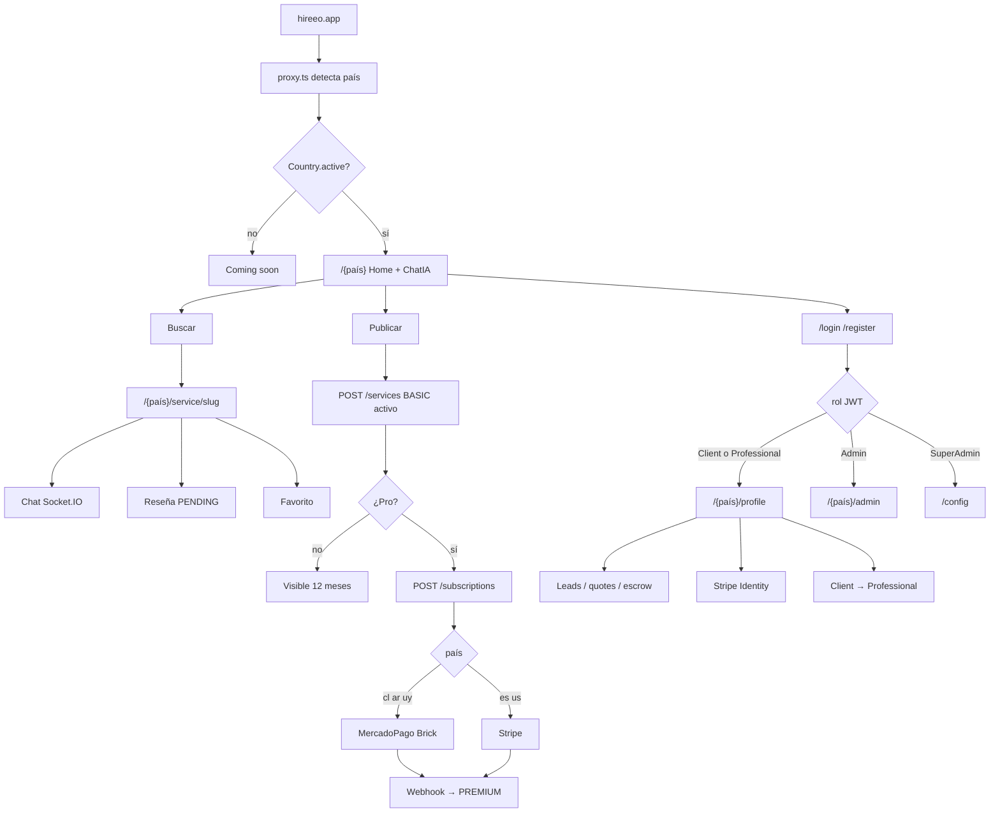

---

## 1. Piezas y cómo se hablan

| Pieza | Puerto | Rol |
|---|---|---|
| Next.js 16 (`frontend/`) | 3334 | UI, routing, Auth.js, Server Actions |
| NestJS 10 (`backend/`) | 4000 `/api/v1` | Negocio, Prisma, pasarelas, WebSocket |
| PostgreSQL 16 | 5435 | Fuente de verdad |

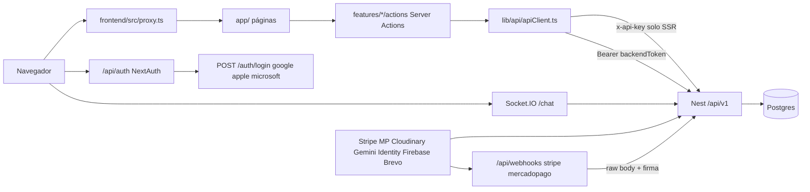

`apiClient` nunca manda `API_KEY` al browser. Las mutaciones van por Server Action + JWT del backend guardado en la sesión de Auth.js.

---

## 2. Entrada y país

Archivo: `frontend/src/proxy.ts`

Orden de detección: cookie `hireeo_country` → `cf-ipcountry` → `x-vercel-ip-country` → `Accept-Language` → default `cl`.

La cookie la escriben `HeroCountrySelector` y el `Footer`.

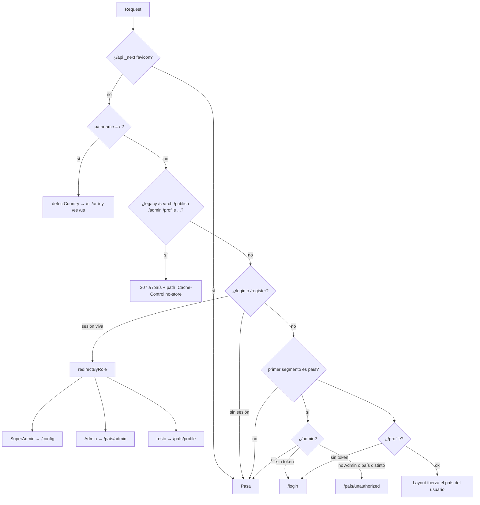

Países en código: `cl` `ar` `uy` `es` `us`. Layout `app/(country)/[country]/layout.tsx` carga `GET /geo/countries/:code` y envuelve en `CountryProvider` (moneda, gateway, labels, `active`, `paymentsEnabled`).

Si `active === false`, el layout **público** muestra `CountryComingSoon`. Admin y perfil siguen vivos.

`/{país}/login|register|contact` hacen 301 a las rutas globales `/login` `/register` `/contact`.

---

## 3. Auth

Roles en DB: `Client`, `Professional`, `Admin`, `SuperAdmin`. El rol va por usuario **y país** (`UserRole.countryId`). SuperAdmin suele ir sin país.

Auth.js **no es la fuente de verdad**. Nest emite access (~15 min) + refresh (~30 d). NextAuth los guarda en la cookie de sesión.

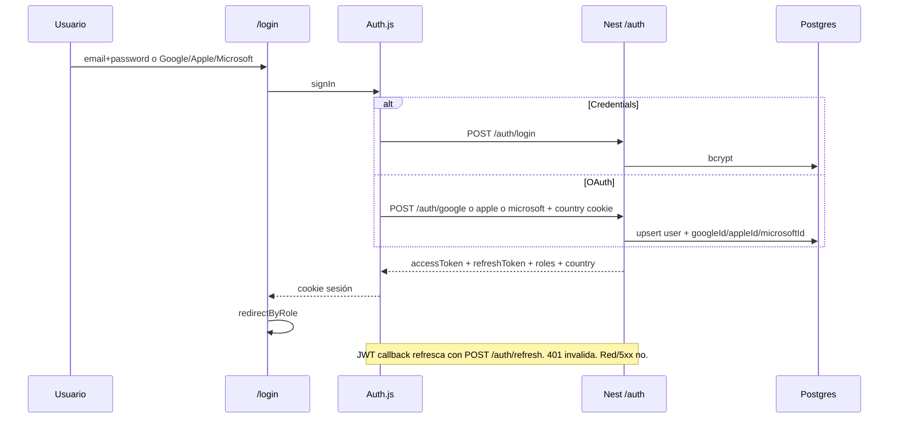

Archivos: `frontend/src/app/api/auth/[...nextauth]/route.ts`, `features/auth/lib/auth.service.ts`, `features/auth/lib/redirectByRole.ts`, `backend/src/modules/auth/`.

OAuth se instancia solo si hay credenciales en `/config/integrations`.

`Client` → `Professional` **no** ocurre al publicar. Es un modal de perfil: `POST /users/me/become-provider` (borra Client, crea Professional en el mismo país).

---

## 4. Buscar un profesional

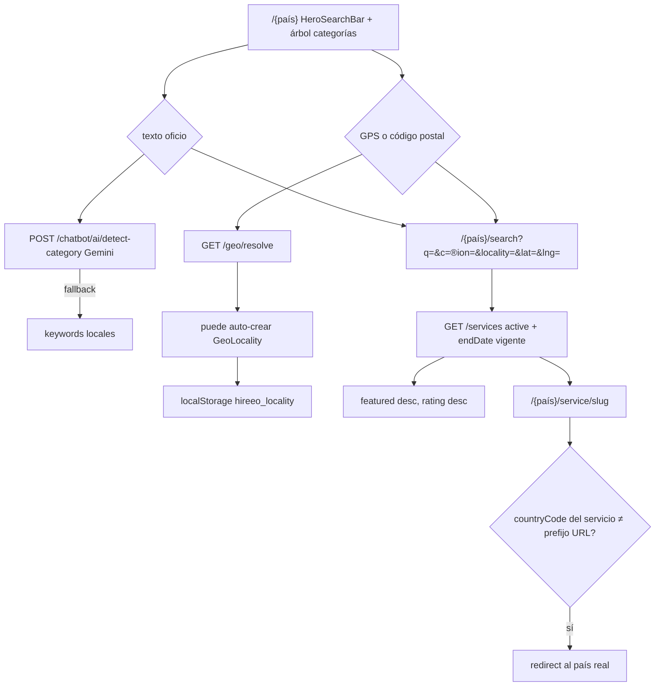

Filtros backend (`ServicesService.findAll`): texto, categoría, comuna, nivel, destacado, país, región, localidad, radio Haversine sobre `geo_localities`.

`isTopPro` = promedio ≥ 4.5 y ≥ 10 reseñas.

Archivos: `app/(country)/[country]/(public)/search/page.tsx`, `features/services/components/search`, `backend/src/modules/services/services.service.ts`.

---

## 5. Ficha, chat, reseña, favorito

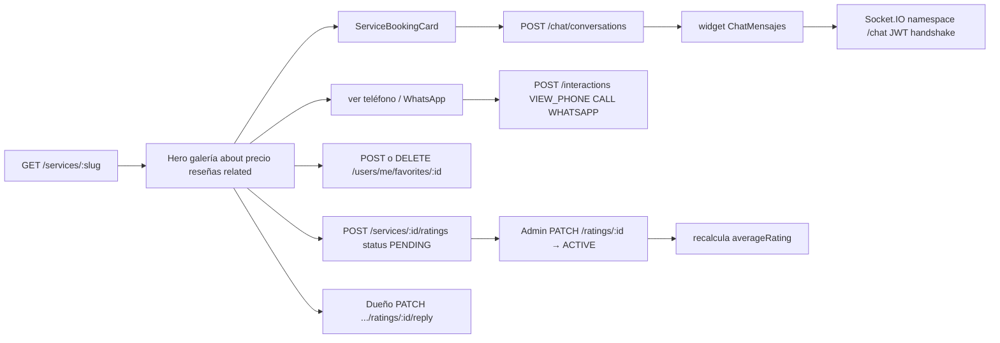

Sin sesión, el chat manda a `/login`.

Archivos: `features/services/components/detail/`, `features/chat/`, `backend/src/modules/chat/chat.gateway.ts`, `backend/src/modules/ratings/`.

---

## 6. Publicar un servicio

Ruta: `/{país}/publish` → `PublicarWizard`.

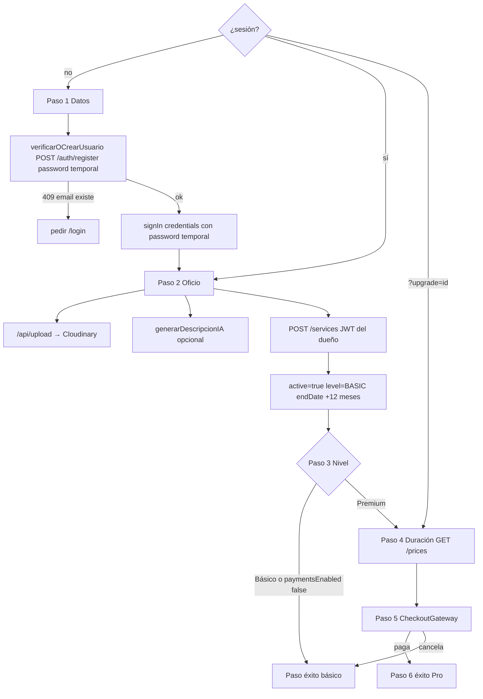

El anuncio **queda visible al crear**. No hay cola de aprobación. El admin puede ocultarlo (`PATCH /services/:id/active`) o destacarlo (`PATCH /services/:id/featured`, que también pone `level=PREMIUM`).

Archivos: `features/services/publish/`, `backend/src/modules/services/services.controller.ts`.

---

## 7. Pago Hireeo Pro

Gateway por país: `cl|ar|uy` → MercadoPago. `es|us` → Stripe. Si `Country.paymentsEnabled === false` → 403 en checkout y el wizard no ofrece Pro.

El importe **no** viaja desde el browser: el backend lo resuelve con `PremiumPrice` (país + duración 1|3|6|9|12).

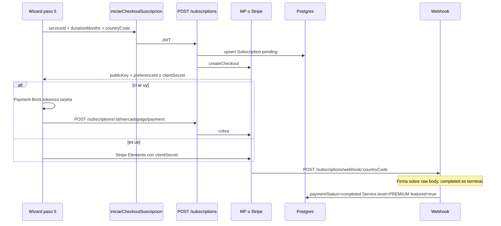

Los Route Handlers `frontend/src/app/api/webhooks/{stripe,mercadopago}/route.ts` **solo reenvían** el body crudo al backend. No verifican firma ni tocan DB.

Archivos: `features/payments/`, `backend/src/modules/subscriptions/`, `backend/src/modules/payments/`.

---

## 8. Leads, cotizaciones, escrow

La **web Next no crea** el pedido (`POST /service-requests` no existe en frontend). Lista, cotiza, acepta y cobra. El alta puede vivir en mobile / API.

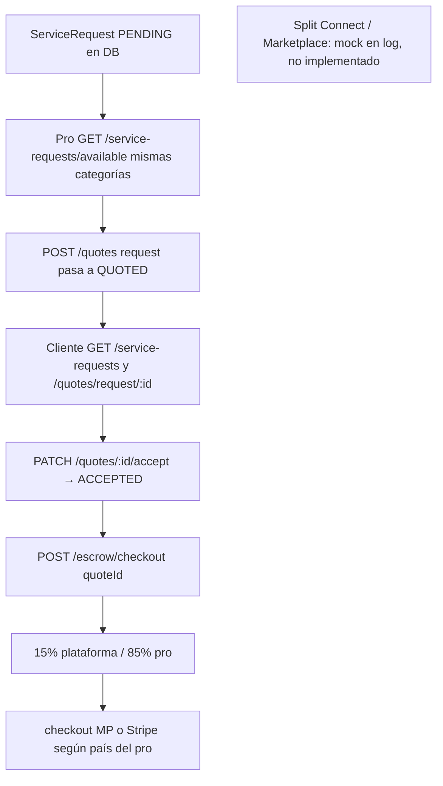

Perfil:

- Cliente → `/{país}/profile/quotes`
- Professional → `/{país}/profile/leads`

Archivos: `features/services/actions/{leads,quotes,escrow}.ts`, `backend/src/modules/{service-requests,quotes,escrow}/`.

---

## 9. KYC

Ruta: `/{país}/profile/verification`.

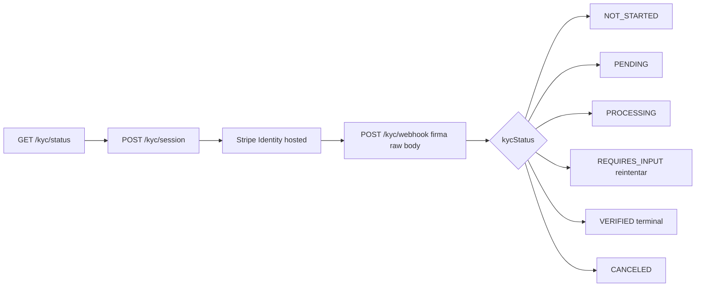

`isKycVerified` se deriva de `kycStatus` en el mismo update.

Archivos: `features/users/actions/kyc.ts`, `backend/src/modules/kyc/`.

---

## 10. Chat en vivo

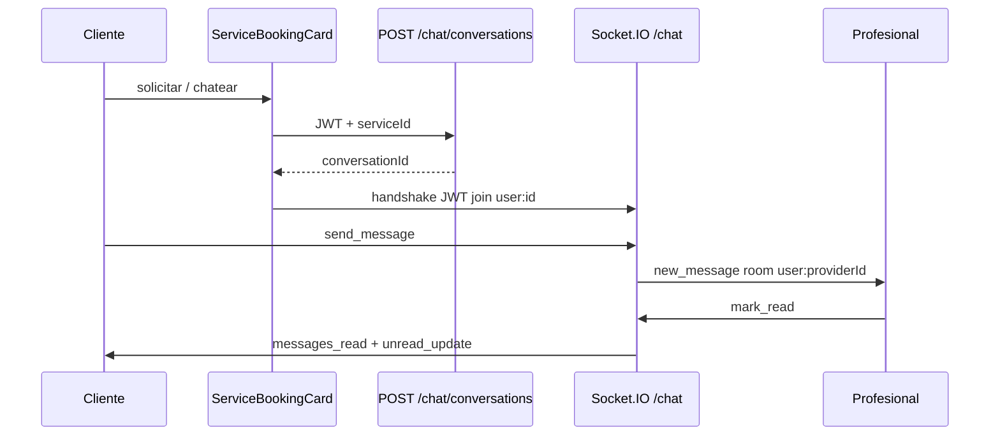

REST: `GET/POST /chat/conversations`, mensajes, `unread-count`, `read`. Gateway: `backend/src/modules/chat/chat.gateway.ts`. Cliente: `features/chat/hooks/useChatSocket.ts`.

---

## 11. Admin

Dos paneles, mismo `AdminSidebar`, distinto `basePath`.

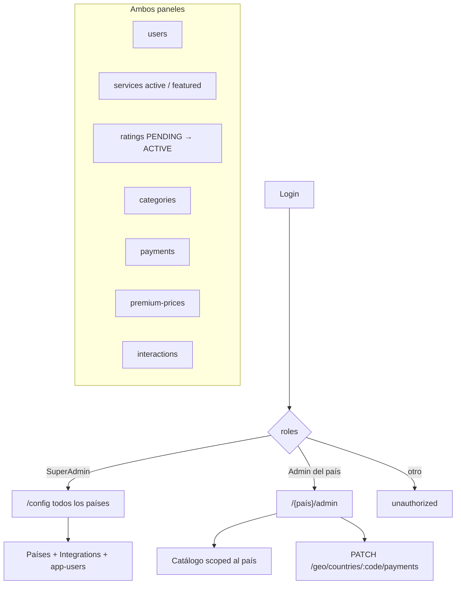

`/config` layout: solo SuperAdmin. `/{país}/admin` layout: SuperAdmin o Admin cuyo `user.country === país`.

Archivos: `app/(config)/config/`, `app/(country)/[country]/(admin)/admin/`, `features/admin/components/AdminSidebar/AdminSidebar.tsx`.

---

## 12. Modelo de datos

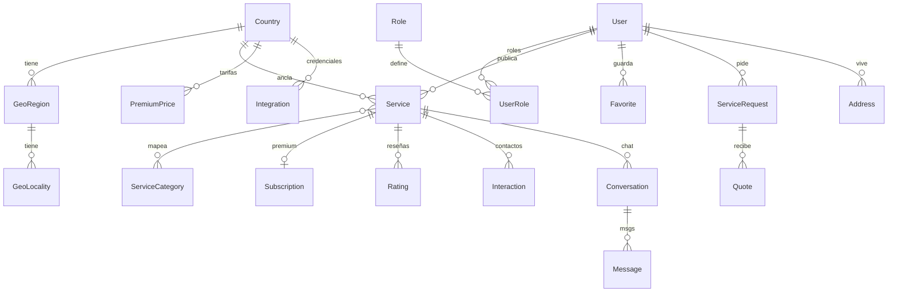

Un `Service` vive en un país, opcionalmente región/localidad, con vigencia `endDate`. Premium es de **servicio**, no de usuario (`Subscription.serviceId` unique).

---

## 13. Capas de seguridad Nest

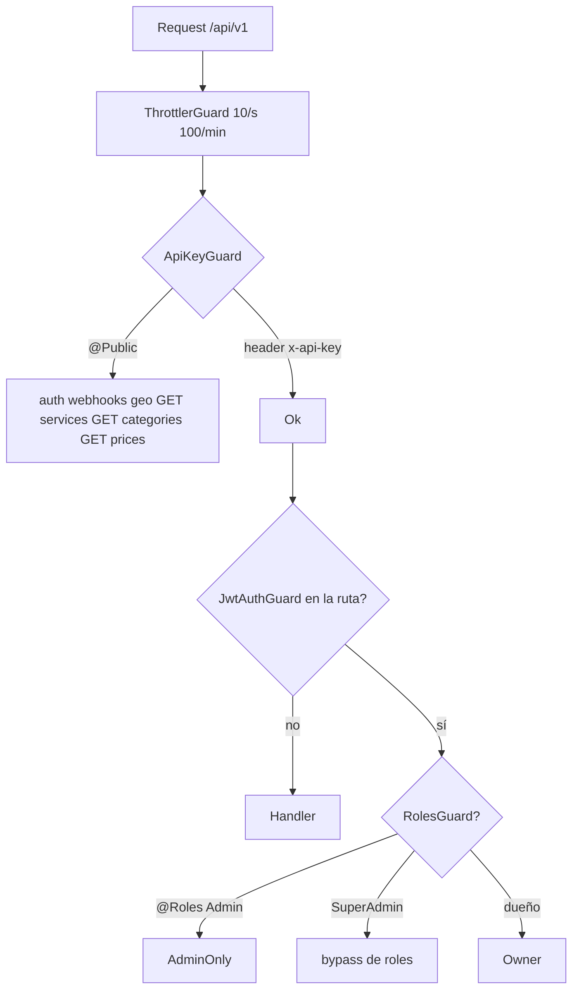

Webhooks de pago y KYC son `@Public()`: la defensa es la **firma criptográfica** del raw body, no un secret header.

---

## 14. Rutas de la web

Prefijo `{c}` = `cl|ar|uy|es|us`.

**Globales:** `/` `/login` `/register` `/contact` `/config/*` `/design-system`

**Público:** `/{c}` `/{c}/search` `/{c}/service/[slug]` `/{c}/publish` `/{c}/pricing` legales y estáticas

**Cuenta (login):** `/{c}/profile` `services` `messages` `quotes` `leads` `favorites` `addresses` `verification` `settings`

**Admin país:** `/{c}/admin` + `users` `services` `ratings` `payments` `premium-prices` `categories` `interactions`

**SuperAdmin extra:** `/config/countries` `/config/integrations` `/config/app-users`

---

## 15. Archivos ancla

| Flujo | Frontend | Backend |
|---|---|---|
| País | `frontend/src/proxy.ts` | `modules/geo/` |
| Auth | `app/api/auth/[...nextauth]/route.ts` | `modules/auth/` |
| Buscar | `features/services/components/search` | `modules/services/services.service.ts` |
| Publicar | `features/services/publish/` | `modules/services/` |
| Pago Pro | `features/payments/` | `modules/subscriptions/` + `modules/payments/` |
| Chat | `features/chat/` | `modules/chat/` |
| Leads | `features/services/actions/leads.ts` | `modules/service-requests/` `modules/quotes/` `modules/escrow/` |
| KYC | `features/users/actions/kyc.ts` | `modules/kyc/` |
| Admin | `features/admin/` `app/(config)` | guards + cada módulo |
| HTTP | `lib/api/apiClient.ts` | `src/main.ts` `app.module.ts` |

Swagger local (no producción): `http://localhost:4000/api/docs`
