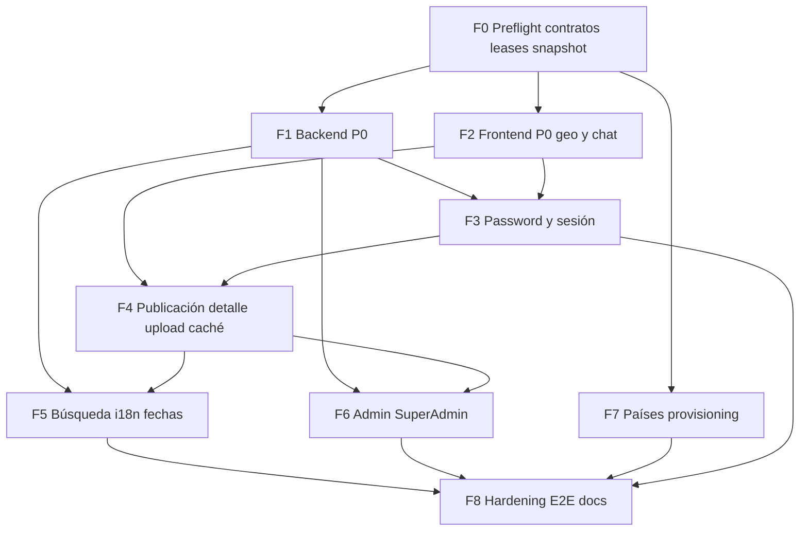

# Plan canónico de remediación E2E

> [!important] Estado
> Plan de **ejecución**. Ninguna incidencia se da por resuelta hasta prueba dirigida, regresión por rol/país y gates de cierre. **No autoriza** `push`, despliegue, producción ni limpieza destructiva. Los commits quedan a cargo de Edgardo; el coordinador no commitea ni pushea.

Síntesis de [[opus-e2e-incidencias]] (diagnóstico, IDs canónicos, DAG, patrones) y [[sol-e2e-incidencias]] (preflight, leases, contratos, seguridad de git, gates conservadores).

**Fuentes de incidencias**: [[e2e-publico-incidencias]] · [[e2e-client-incidencias]] · [[e2e-professional-incidencias]] · [[e2e-admin-incidencias]] · [[e2e-superadmin-incidencias]] · [[e2e-publicacion-multipais-incidencias]]
**Planes de prueba**: [[../testingqa/README]]

---

## 0. Cómo se fusionaron los dos planes

| Tema | Opus | SOL | Resolución canónica |
|---|---|---|---|
| IDs | `INC-xxx` + renumeración de colisiones | Prefijos `PUB-`/`CLI-`/`PRO-`/`MP-`/`ADM-`/`SUP-` | **`INC-xxx` canónicos** (trazan a los 6 informes). Mapping a IDs SOL en §1.2 |
| ServiceRequest | No construir wizard (feature, no bug) | Wizard mínimo con DTO actual | **No se construye.** Se actualiza el caso E2E. Gate `G-REQUEST` |
| Países (INC-019) | Catálogo dinámico completo desde DB | Provisioning: no operativo hasta readiness | **Provisioning honesto + inventario.** Completar routing dinámico solo si el inventario es ≤15 puntos y no toca Prisma; si no, UI honesta + error real al crear Admin |
| Sesión tras password | Refresh o logout | Logout limpio | **Logout limpio** con aviso y retorno a login |
| Teléfono | Requerido en create y update | Alinear create/update | **Requerido en ambos** |
| Taxonomía | Admin crea con su `countryCode` | Catálogo global; Admin no crea globales | **Patrón AUD-18**: Admin scoped a su país; solo SuperAdmin crea globales |
| Política de password | Unificar a 8 + mayúscula + especial | 8 + mayúscula + minúscula + número + especial | **Política SOL** (el fixture `Hireeo2026!Test` ya la cumple) |
| Commits | Coordinador commitea al cerrar fase | Ni commit ni push automáticos | **Sin commit/push.** Checkpoints congelan diffs y reportan |
| Worktree extra | F6 en worktree aislado | Solo si hay conflicto real | **Worktree actual.** F6 aislado solo si el inventario completo arranca y toca `proxy.ts`/`layout` |
| Workers concurrentes | Máx. 4 | Máx. 3 editores + coordinador | **Máx. 3 editores** |
| Preflight | Seed + snapshot + ramas | Revalidar FAIL, contratos, leases | **Preflight SOL + snapshot Opus** |
| Reset password | Email antes de persistir | Token hasheado de un uso, atómico, anti-enumeración | **Diseño SOL** (más completo; incluye el invariante de Opus) |
| Premium UI | Fuera de alcance (`paymentsEnabled=false`) | Read-only + badge + writes bloqueados | **Read-only honesto**; no se activan pagos |
| Hardening `.parse()` | Fase F7 transversal a 7 archivos | Contrato-first en F0 | **Contratos en F0; helper `parseOrFail` al final** (tras cerrar mutaciones puntuales) |

Los informes originales de Opus y SOL se conservan como proveniencia. Este archivo es el único que se ejecuta.

---

## 1. Resumen ejecutivo

| Métrica | Valor |
|---|---|
| Incidencias únicas de código | **25** (INC-014/MP cerrado como duplicado de INC-009) |
| Críticas | 4 — INC-002, INC-005, INC-006, INC-012 |
| Altas | 12 |
| Medias | 5 |
| Bajas / UX | 4 |
| Decisiones de producto / docs | 4 — `G-REQUEST`, E2E-PUB-005, Premium N/A, KYC BLOCKED |
| Fases | 9 (F0 → F8) |
| Editores concurrentes máximos | 3 |
| Worktrees extra | 0 por defecto (F6 aislado solo si Gate G-COUNTRY = completo) |
| Duración estimada | 3–5 jornadas de agente |

### Hallazgos que ambos planes confirman

1. **INC-014 del plan multipaís no es un bug distinto de INC-009.** Mismo archivo `frontend/src/features/services/publish/actions/mutations.ts` (líneas ~172–179), mismo literal `'No se encontraron categorías válidas'`. Un solo fix cierra las dos.
2. **Colisión de numeración**: Professional y Publicación-Multipaís reutilizaron INC-012, INC-013 e INC-014. Se conservan los IDs de Professional; los de Multipaís pasan a INC-023, INC-024; INC-014/MP se cierra como duplicado.
3. **INC-007.2 e INC-008 son, con alta probabilidad, síntomas de INC-012**: `stripSensitiveFields` guarda `Prisma.Decimal` y no `Date`. Se valida en el checkpoint de F1 antes de gastar trabajo en formateo cosmético.
4. Superficie de `Schema.parse()` fuera de try/catch: **7 archivos** de Server Actions (`configuration/countries`, `payments/premium`, `contact`, `users`, `categories`, `services`, `reviews`). Auditoría cerrada.
5. INC-018 arrastra un segundo defecto: `getAdminPreciosPremium` calcula `totalPages` y nunca hace `slice`.

### Hallazgos que solo SOL aporta y se adoptan

- El worktree ya tiene cambios ajenos y archivos sin seguimiento: **prohibido limpiar, resetear o incorporar diffs no atribuibles a este plan**.
- `worker_done` no cierra una tarea: el coordinador lee el diff y ejecuta la prueba dirigida.
- El reset de contraseña debe ser token de un uso, hasheado, con expiración y consumo atómico; el fallo de Brevo no toca hash, `emailVerified` ni `tokenVersion`.
- Falta guard de rol en las **páginas** `/profile/leads` y `/profile/services`, no solo en los endpoints.
- Hay un caso de seguridad de chat (deep link ajeno) que no estaba en Opus.
- NestJS: `pnpm build` no basta; hay que arrancar el backend compilado y hacer smoke HTTP (DI).

---

## 2. Registro canónico de incidencias

### 2.1 Resolución de colisiones

| ID original | Documento | ID canónico | Motivo |
|---|---|---|---|
| INC-012 | publicación multipaís (redes sociales) | **INC-023** | Colisiona con INC-012 Professional (interceptor `Date`) |
| INC-013 | publicación multipaís (rate limit upload) | **INC-024** | Colisiona con INC-013 Professional (contador reseñas) |
| INC-014 | publicación multipaís (IA) | **cerrada como duplicado de INC-009** | Mismo archivo, misma línea, mismo fix |
| INC-015 | publicación multipaís (i18n wizard) | **INC-015** | No colisiona |

### 2.2 Mapping Opus ↔ SOL

| INC | ID SOL | Título corto | Sev. | Capa | Archivo principal | Fase |
|---|---|---|---|---|---|---|
| INC-001 | PUB-001A/B | Home: ubicación como `q` + slugs `CATEGORY_MAP` inexistentes | Alta | FE | `features/home/components/HeroSearchBar/HeroSearchBar.tsx`, `features/services/actions/matchmaking.ts` | F5 |
| INC-002 | PUB-002 | `forgotPassword` persiste el password antes de enviar el email | **Crítica** | BE | `modules/auth/auth.service.ts:282-309` | F1 |
| INC-003 | CLI-003 | `/profile/leads` y `/profile/services` sin guard Professional | Media | FS | `service-requests.controller.ts`, `quotes.controller.ts`, `(account)/profile/leads/page.tsx` | F1 |
| INC-004 | CLI-004 | Cambio de contraseña exitoso reporta error falso | Alta | FE | `features/users/actions/mutations.ts:165-186` | F3 |
| INC-004b | CLI-004B | Copy de requisitos inconsistente registro vs. cambio | Baja | FS | `features/users/schemas/userSchemas.ts`, `auth/dto/register.dto.ts` | F3 |
| INC-005 | CLI-005 | `AddressForm` usa endpoint SuperAdmin → país vacío | **Crítica** | FE | `features/users/components/admin/AddressForm/AddressForm.tsx:9,262` | F2 |
| INC-006 | CLI-006 | Widget de chat lee `session.user.token` (no existe) | **Crítica** | FE | `features/chat/components/ChatMensajes/ChatMensajes.tsx:37` | F2 |
| INC-007 | CLI-007 | `ChatWindow` sin optimistic real + "Invalid Date" | Media | FE | `features/chat/components/ChatWindow/ChatWindow.tsx` | F2 |
| INC-008 | CLI-008 | "Invalid Date" / "hace NaN d" en Leads y Cotizaciones | Baja | FE | `features/services/components/**`, `features/geo/lib/countryUtils.ts` | F5 (dep. F1) |
| INC-009 | PRO-009 / MP-014 | "Completar con IA": `{data:[]}` vs. array plano | Alta | FE | `features/services/publish/actions/mutations.ts:172-179` | F4 |
| INC-010 | PRO-010 | Editar servicio sin teléfono → JSON crudo de Zod | Alta | FE | `features/services/schemas/serviceSchemas.ts`, `features/services/actions/mutations.ts` | F4 |
| INC-011 | PRO-011 | Ficha pública stale 60s (falta `revalidateTag`) | Media | FE | `features/services/actions/mutations.ts:170-232` | F4 |
| INC-012 | PRO-012 | Interceptor global convierte todo `Date` en `{}` | **Crítica** | BE | `common/interceptors/serialize.interceptor.ts:18-29` | F1 |
| INC-013 | PRO-013 | `totalCalificaciones` hardcodeado en 0 | Alta | FE | `features/users/actions/queries.ts:183-187` | F5 |
| INC-014 | PRO-014 | Cambiar contraseña rompe la sesión (loop redirect) | Alta | FS | `features/users/actions/mutations.ts`, `app/api/auth/[...nextauth]/route.ts` | F3 |
| INC-015 | MP-015 | Wizard de publicación hardcodeado en español | Media-Alta | FE | `features/services/publish/components/Paso2TuOficio/Paso2TuOficio.tsx` | F5 |
| INC-016 | ADM-016 | Admin de país crea categorías globales | Alta | FS | `modules/categories/categories.controller.ts:62-69` | F1 + F6 |
| INC-017 | ADM-017 | Editar/desactivar categoría global falla en silencio | Baja | FE | `features/categories/components/admin/CategoriasTable/CategoriasTable.tsx` | F6 |
| INC-018 | ADM-018 | Buscador Precios Premium no filtra + paginación falsa | Baja | FE | `features/payments/actions/queries.ts:185-186` | F6 |
| INC-019 | SUP-019 | Países hardcodeados; `/config/countries` no lanza mercado | Alta | FS | `proxy.ts:8`, `[country]/layout.tsx:9`, `register.dto.ts` | F7 |
| INC-020 | SUP-020 | Admin→SuperAdmin deja `countryId` residual | Media | BE | `modules/users/*` | F1 |
| INC-021 | SUP-021 | Precios Premium: conteos stale hasta refresh | Media | FE | `app/(config)/config/premium-prices/*` | F6 |
| INC-022 | SUP-022 | `/{country}/admin` muestra KPIs globales a SuperAdmin | Alta | FE | `app/(country)/[country]/(admin)/admin/page.tsx:26-32` | F6 |
| INC-023 | MP-012 | Redes sociales persistidas no se renderizan | Alta | FE | `features/services/components/detail/**` | F4 |
| INC-024 | MP-013 | Rate limit upload por IP (20/h) + 429 genérico | Alta | FS | `modules/upload/upload.controller.ts:23` | F4 |

### 2.3 Fuera de alcance de código

| ID | Hallazgo | Tratamiento |
|---|---|---|
| `G-REQUEST` / E2E-CLI-009 | Wizard de `ServiceRequest` inexistente; ambos CTA abren chat | Actualizar el caso E2E al flujo real. No construir wizard |
| `DOC-SLUG` / E2E-PUB-005 | Slug ajeno da 404; redirect solo defensivo (AUD-32) | Corregir el caso de prueba: 404 es correcto |
| `CFG-PAY` | Premium `NOT-APPLICABLE` (`paymentsEnabled=false`) | No activar pagos. UI de precios read-only (INC-018/021) |
| `CFG-KYC` | Stripe KYC sin credenciales | `BLOCKED`; no simular proveedor |

---

## 3. Patrones transversales

Cada patrón se remedia **una vez** y se aplica a todas sus instancias.

| Patrón | Instancias | Remediación | Fase |
|---|---|---|---|
| **P1** — `.parse()` fuera de try/catch | INC-004, INC-010, INC-014 | Helper `parseOrFail<T>()` en `shared/lib/`; aplicar a los 7 archivos conocidos | F8 |
| **P2** — `catch` que oculta la causa | INC-004, INC-005, INC-014, INC-019, INC-024 | Toast/error con causa accionable; nunca descartar el mensaje del backend | F8 |
| **P3** — Fechas rotas | INC-007.2, INC-008, INC-012 | Guard `Date` en interceptor + ISO en servicios + `formatDate` defensivo | F1 → verifica F5 |
| **P4** — Caché sin invalidación | INC-011, INC-021 | `revalidateTag` en toda mutación de entidad con ficha/listado | F4 / F6 |
| **P5** — Buscadores decorativos / paginación falsa | INC-018 | Propagar `search`; `slice` o `skip/take` real | F6 |
| **P6** — Contrato `apiClient` `{data:[]}` vs. array plano | INC-009 | Auditar `apiClient.get<{data:…}>` y alinear | F4 → auditoría F8 |
| **P7** — `tokenVersion` invalida sesión | INC-002, INC-004, INC-014 | Tras cambio propio: logout limpio. Reset: no tocar hash si el email falla | F1 / F3 |
| **P8** — Guards de rol ausentes | INC-003 | `@Roles()` en backend **y** verificación de rol en Server Components | F1 |
| **P9** — Catálogo de países hardcodeado | INC-019 | Fuente: tabla `countries`. Activar país = provisioning, no mercado instantáneo | F7 |

---

## 4. DAG



**Reglas del DAG**

- F1 y F2 arrancan juntos (submódulos distintos, archivos disjuntos).
- F1 bloquea F5 solo por INC-008: no se toca formateo de fechas hasta el informe T1.3.
- F3 es síncrona y de un solo worker: toca autenticación y las mismas mutaciones que INC-004/014.
- F7 puede arrancar desde F0 en paralelo **solo** en modo mitigación (UI honesta + error real). El modo completo espera el inventario y, si toca `proxy.ts`/`layout`, se aísla.
- F8 va al final: toca los mismos archivos que F3–F6 y colisionaría con fases abiertas.
- Máximo **3 workers editores** vivos. Si una ola tiene más de 3 tareas independientes, se parte.

---

## 5. Política de ejecución

### 5.1 Worktree sucio

Ya hay cambios ajenos y archivos sin seguimiento. Cada tarea **comprueba el diff antes de editar**. Prohibido `git clean`, `reset --hard`, stash masivo o incorporar cambios no atribuibles a este plan.

Se trabaja en el worktree actual (`Pre-Produccion-Eruotolo`). No se crea worktree por fase.

### 5.2 Un archivo, un dueño (leases)

Ningún archivo tiene dos workers en la misma ola.

| Lease | Dominio | Orden |
|---|---|---|
| `L-AUTH-BE` | `modules/auth/**`, reset, tokenVersion | T1.4 → T3.* |
| `L-SERIALIZE` | `serialize.interceptor.ts`, fechas backend | T1.1–T1.3 → T5.5 |
| `L-USERS-FE` | `features/users/actions/mutations.ts`, ajustes | Solo W-FS-1 en F3 |
| `L-CHAT-FE` | `ChatMensajes`, `ChatWindow`, socket | T2.3–T2.5 en un solo worker |
| `L-ADDRESS` | `AddressForm` + geo countries público | T2.1 |
| `L-PUBLISH` | `publish/actions/mutations.ts` | T4.1 (INC-009 = INC-014/MP) |
| `L-PASO2` | `Paso2TuOficio.tsx` + diccionarios | T4.7 → T5.3 (secuencial) |
| `L-SERVICE-MUT` | `features/services/actions/mutations.ts` + schemas | T4.2 → T4.3 (mismo worker) |
| `L-CATEGORIES` | categories controller/service/form/table | T1.6 → T6.4–T6.6 |
| `L-PRICES` | precios premium queries/UI | T6.3 → T6.7 |
| `L-COUNTRIES` | `proxy.ts`, layout, register.dto, webhooks, config countries | Un solo owner en F7 |
| `L-HERO` | `HeroSearchBar` + matchmaking | T5.1–T5.2 |

Casos que forzaron el diseño:

| Archivo | Incidencias | Resolución |
|---|---|---|
| `features/services/actions/mutations.ts` | INC-010, INC-011 | Mismo worker, secuencia |
| `features/users/actions/mutations.ts` | INC-004, INC-014, INC-019 | INC-004+014 en F3; INC-019 no toca este archivo salvo T7.4 y solo después de F3 |
| `publish/actions/mutations.ts` | INC-009, INC-014/MP | Una sola tarea |
| `Paso2TuOficio.tsx` | INC-024 UI, INC-015 | Upload primero, i18n después |

### 5.3 Git

**Regla dura**: ningún worker ejecuta `git add`, `git commit`, `git stash`, `git checkout` ni `git push`. Dos workers en el mismo submódulo compiten por `index.lock`.

El coordinador **tampoco commitea ni pushea**. Al cerrar fase: `git status` + `git diff` por submódulo, lista de archivos tocados, y para. Los commits los pide Edgardo.

No tocar `package.json`, lockfiles, `tsconfig.json`, `biome.json`, Prisma schema, Next/Nest/Playwright config, ni agregar paquetes.

### 5.4 Build y verificación

Workers, solo barato:

```bash
pnpm --filter backend lint
pnpm --filter backend exec tsc --noEmit
pnpm --filter frontend lint
pnpm --filter frontend type-check
```

**Ningún worker ejecuta `pnpm build`.** Limpia `.next` y corrompe Turbopack si `pnpm dev` está activo.

En el checkpoint de fase, el coordinador:

1. Detecta `pnpm dev` del worktree; lo detiene solo si hace falta el build.
2. `pnpm lint && pnpm build` desde la raíz.
3. Arranca el **backend compilado** y hace smoke HTTP (NestJS DI). El build verde no basta.
4. Reinicia dev solo si estaba activo; comprueba puertos 3334 / 4445 / 5435.

### 5.5 Skills y frontera de capas

- Worker de `frontend/` carga skill `nextjs-ddd-expert`.
- Worker de `backend/` carga skill `nestjs-architect`.
- Skill ausente → tarea `BLOCKED`, no se improvisa.
- Frontend no escribe Nest/Prisma. Backend no escribe JSX/Tailwind.
- Coordinación: skill `orchestration` / Orca CLI.
- Componentes: carpeta propia, archivo = nombre del componente, **nunca** `index.tsx`.

### 5.6 Modelos (eficiencia de tokens)

No usar Fable, Opus 5 ni Extra High/Max/Ultra.

| Trabajo | Modelo | Esfuerzo | Razón |
|---|---|---|---|
| Coordinación / DAG | Grok 4.6 o Sonnet 5 o `gpt-5.6-terra` | Medium | Cotidiano |
| Auth reset, interceptor, roles P0 | `gpt-5.6-sol` o Sonnet effort alto | High | Riesgo de integridad |
| Backend / frontend rutinario | Sonnet 5 / `gpt-5.6-terra` / Grok 4.6 | Medium | Diagnóstico ya cerrado |
| Auditoría mecánica, i18n voluminoso, inventario | Haiku 4.5 / `gpt-5.6-luna` | Low–Medium | Superficie acotada |
| F7 modo completo (países dinámicos) | `gpt-5.6-sol` | High | Arranque transversal |

Si un launcher falla, Orca registra el intento y usa el siguiente modelo válido. Jamás se atribuye trabajo a un worker que no arrancó.

### 5.7 Fixtures y datos

- Solo fixtures locales. No tocar SuperAdmin reales (`edgardoruotolo@gmail.com`, `nluis@outlook.com`, `luisnuy@gmail.com`) ni países reales de forma destructiva.
- Contraseña estándar de prueba: `Hireeo2026!Test`. Si un worker la cambia, **restaurarla antes de `worker_done`**.
- Fixtures nuevos: `E2E-<ROL>-<PAIS>-<timestamp>`. Limpieza solo de IDs de la corrida, con procedimiento autorizado.
- Snapshot de DB en T0.4 (fuera de git). Proveedores externos solo sandbox; sin credenciales = `BLOCKED`.

---

## 6. Fases

Convención: `T<fase>.<n>` · **SYNC** = el coordinador espera · **ASYNC** = paralelo dentro de la ola, máx. 3 editores.

### F0 — Preflight, contratos y evidencia · SYNC · coordinador

Ningún editor arranca sin caso reproducible, lease y criterio de rollback.

| Tarea | Acción | Criterio |
|---|---|---|
| T0.1 | Capturar status raíz/submódulos, procesos dev, puertos 3334/4445/5435 y diffs ajenos | Informe de baseline; diffs ajenos listados y **no tocados** |
| T0.2 | Levantar `docker-database`, `pnpm dev:backend`, `pnpm dev:frontend`; seed si geo vacío | `GET /geo/countries` → 5 países |
| T0.3 | Revalidar cada FAIL de los 6 informes: `confirmed` / `stale` / `duplicate` / `decision` / `external-blocked` | Ledger incidencia → clasificación |
| T0.4 | `pg_dump` a `.doc/testingqa/snapshots/baseline-<fecha>.sql` (fuera de git) | Snapshot restaurable |
| T0.5 | Congelar contratos: reset password, país público vs admin, categoría create, fecha ISO, 429 upload, ServiceRequest (chat-only) | Nota de contratos en este archivo o anexo |
| T0.6 | Ledger incidencia → archivo → test → lease | Tabla §5.2 aplicada a las olas |
| T0.7 | Registrar la renumeración canónica como nota al pie en `e2e-professional-incidencias.md` y `e2e-publicacion-multipais-incidencias.md` | Ambos apuntan a INC-023/024 y al duplicado INC-009 |
| T0.8 | Crear el Run de Orca y las tareas de la primera ola con `deps` | `orca orchestration task-list --json` |

```bash
orca orchestration run-create \
  --objective "Remediación E2E Hireeo — plan canónico grok-e2e-incidencias (F0-F8)" --json
```

No crear ramas nuevas salvo que Edgardo lo pida. No limpiar el índice.

---

### F1 — Backend P0 · ASYNC · 2 workers

Arranca junto con F2. Submódulo `backend/`.

#### W-BE-1 — Serialización (`gpt-5.6-sol` o Sonnet high)

Skill: `nestjs-architect`. Lease: `L-SERIALIZE`.

| Tarea | INC | Alcance |
|---|---|---|
| T1.1 | INC-012 | Guard de `Date` en `stripSensitiveFields` junto al de `Prisma.Decimal`. Revisar también `Buffer`, `Map`, `Set`, `BigInt` |
| T1.2 | INC-012 | Tests de contrato: arrays, Decimal, `null`, campos sensibles. Normalizar `chat.service.ts` (`date`, `lastMessageAt`) a `.toISOString()`. Auditar respuestas que devuelvan `Date` crudo |
| T1.3 | P3 | Informe en `.doc/testingqa/` de endpoints que devolvían fechas rotas — **insumo de F5/INC-008** |

Aceptación: conversación con mensajes devuelve `date` como string ISO; `/cl/profile/messages` no cae con 500.

#### W-BE-2 — Auth, RBAC, roles (`gpt-5.6-sol` o Sonnet high)

Skill: `nestjs-architect`. Leases: `L-AUTH-BE`, categorías create, users roles.

| Tarea | INC | Alcance |
|---|---|---|
| T1.4 | INC-002 | Token reset de un uso, **hasheado**, con expiración y consumo atómico. Enviar email **antes** (o transacción con compensación). Si Brevo falla: **no** cambian hash, `emailVerified` ni `tokenVersion`. Respuestas anti-enumeración |
| T1.5 | INC-003 | `@Roles(Role.PROFESSIONAL)` en `GET /service-requests/available` y `GET /quotes/my-quotes`. Client autenticado → 403. Professional → 200 |
| T1.6 | INC-016 BE | `POST /categories`: `@CurrentUser()`, `assertAdminCanManageCategory` como en update/delete. Admin crea con **su** `countryCode`; solo SuperAdmin crea globales. `countryCode` y `parentId` en `CreateCategoryDto` |
| T1.7 | INC-020 | Al pasar a SuperAdmin: `countryId = NULL`. Al pasar a Admin: país obligatorio. Promoción/degradación atómicas. Script de corrección para filas ya inconsistentes (no tocar SuperAdmin reales) |

`T1.6` y `T1.7` **no** en paralelo si comparten controller/service de users vs. categories (archivos distintos → OK en paralelo; si el worker de users toca categorías, serializar).

Aceptación: Brevo caído no cambia el hash; Client 403 en endpoints Pro; `admin.cl` no crea categoría global; promover a SuperAdmin deja `countryId IS NULL`.

**Checkpoint F1**: lint + tsc backend + tests unitarios del interceptor y auth + **validar hipótesis P3**. El resultado recorta T5.5.

---

### F2 — Frontend P0 · ASYNC · 2 workers (en paralelo con F1)

Máx. 3 editores globales: si F1 tiene 2 vivos, F2 arranca 1 y encola el segundo, o F1 cierra W-BE-1 primero. Recomendación de olas: ver §8.

#### W-FE-1 — Direcciones (`claude` / sonnet o terra)

Skill: `nextjs-ddd-expert`. Lease: `L-ADDRESS`.

| Tarea | INC | Alcance |
|---|---|---|
| T2.1 | INC-005 | Consumir `GET /geo/countries` (`@Public()`), tipado con `id`. **No** `getAdminCountries`. Eliminar el `catch` que devuelve `[]`. El modal admin de países inactivos conserva su loader propio |

Aceptación: Client crea y edita dirección completa (país→región→localidad) en `cl` y en `es`.

#### W-FE-2 — Chat y páginas Pro (`claude` / sonnet o terra)

Skill: `nextjs-ddd-expert`. Lease: `L-CHAT-FE`. T2.5 (páginas) no comparte archivos con chat.

| Tarea | INC | Alcance |
|---|---|---|
| T2.2 | INC-006 | `ChatMensajes.tsx` lee `session.user.backendToken`. Sin `any`. Evaluar deduplicar socket contra `ChatWindow.tsx` (esa ya lo hace bien) |
| T2.3 | INC-006 | `handleSend()`: sin socket → error visible, nunca mensaje fantasma. Sin optimistic de envío no persistido |
| T2.4 | INC-007 | Optimistic con ID temporal + reconciliación. `join_conversation` **antes** de `send_message` |
| T2.5 | INC-003 FE | Pages `/profile/leads` y `/profile/services`: verificar rol Professional **antes** de cargar datos. Client → unauthorized, sin mutar |

Aceptación: mensaje del widget llega a DB y al Professional; el emisor ve su mensaje; Client no entra a leads/services Pro.

**Checkpoint F2**: lint + type-check frontend. Diff revisado por el coordinador. Prueba dirigida de dirección y chat.

T2.6 (seguridad chat / deep link ajeno) se ejecuta en F5 cuando el socket ya funciona — ver T5.6.

---

### F3 — Contraseñas y sesión · SYNC · 1 worker

Depende de T1.4 (`tokenVersion`). Un solo worker. Effort alto.

Skill frontend `nextjs-ddd-expert`; si toca `register.dto.ts`, el mismo worker carga también `nestjs-architect` o se parte el DTO al worker backend **en secuencia**, no en paralelo.

Lease: `L-USERS-FE` + tramo FE de `L-AUTH-BE`.

| Tarea | INC | Alcance |
|---|---|---|
| T3.1 | INC-014 A | Tras cambio propio exitoso: **logout limpio** con aviso y retorno a login. Nunca `ERR_TOO_MANY_REDIRECTS` |
| T3.2 | INC-004 | `actualizarPassword`: `passwordUpdateSchema.parse()` dentro de try/catch; `{ error }` legible. Confirmar si el "error falso" era Zod o un fallo real |
| T3.3 | INC-014 B | Errores por campo: actual incorrecta; política no cumplida; no coinciden |
| T3.4 | INC-004b | Una sola política: **8+, mayúscula, minúscula, número, carácter especial**. Mismo copy en registro y cambio. Solo se exige a passwords **nuevos** (fixtures actuales ya cumplen) |
| T3.5 | INC-002 UI | UI request/confirm reset alineada al contrato de T1.4; mensaje anti-enumeración |

Aceptación: éxito real; sesión cierra limpio; tres errores distintos; fixtures restaurados a `Hireeo2026!Test`; login real posterior.

**Riesgo**: el worker cambiará contraseñas de prueba. Restaurar **antes** de `worker_done`.

---

### F4 — Publicación, detalle, upload, caché · ASYNC · 3 workers

Depende de F2 cerrado para no saturar el cupo. T4.2/T4.3 en el mismo worker (`L-SERVICE-MUT`). T4.7 (upload UI en Paso2) **antes** de T5.3 (i18n del mismo archivo).

#### W-FE-3 — IA y ficha

| Tarea | INC | Alcance |
|---|---|---|
| T4.1 | INC-009 (+ INC-014/MP) | `generarDescripcionIA` consume el array plano (patrón de `categories/actions/queries.ts:88`). Verificar Gemini punta a punta invitado **y** Professional |
| T4.6 | INC-023 | Componente `features/services/components/detail/ServiceSocialLinks/ServiceSocialLinks.tsx` (regla de oro). 8 tipos, Lucide, URLs seguras, a11y. El dato ya llega mapeado en `queries.ts:59-63,81` |

#### W-FE-4 — Schema, teléfono, caché

| Tarea | INC | Alcance |
|---|---|---|
| T4.2 | INC-010 | Unificar `telefonoContacto` requerido en create y update. Zod legible **antes** de la Server Action |
| T4.3 | INC-011 | `revalidateTag('servicio-slug-{country}-{slug}')` en update, toggle y delete. Invalidar también listados afectados |

#### W-FS-3 — Upload

| Tarea | INC | Alcance |
|---|---|---|
| T4.4 | INC-024 BE | Throttle de `/upload` **por usuario autenticado**; fallback IP solo anónimos. Límite largo ≥60/h (5 imágenes × varias publicaciones). Exponer `Retry-After`. Cleanup de huérfanos |
| T4.5 | INC-024 FE | `Paso2TuOficio.uploadImage`: `429` con espera explícita. **No perder trabajo**: no re-subir las imágenes ya OK |

Aceptación: IA devuelve descripción; servicio sin teléfono no se crea; ficha refleja el cambio en el siguiente request; 8 redes visibles con enlace; 5 publicaciones seguidas desde la misma IP con usuarios distintos no se bloquean.

---

### F5 — Búsqueda, i18n, fechas residuales, métricas Pro · ASYNC · 3 workers

INC-008 se recorta según T1.3.

#### W-FE-5 — Home

| Tarea | INC | Alcance |
|---|---|---|
| T5.1 | INC-001 A | Ubicación escrita a mano se resuelve contra geo del país (match difuso) o se exige selección. Nunca `q=ubicación`. "Describe el problema" viaja como texto |
| T5.2 | INC-001 B | Auditar `CATEGORY_MAP`/`CATEGORY_LABELS` contra `SELECT slug FROM service_categories`. `gasfiteria` no existe (`plomeria`). Verificar `jardineria`, `techos`, `linea-blanca`, `climatizacion`. Preferir derivar el mapa de la DB |

#### W-FE-6 — i18n wizard

| Tarea | INC | Alcance |
|---|---|---|
| T5.3 | INC-015 | Pasos 1–3 al sistema `getDictionary` de `service/[slug]/page.tsx`. Incluye "Selecciona state". Paridad de claves ES/EN. **Después** de T4.5 (mismo `Paso2TuOficio.tsx`) |

#### W-FE-7 — Fechas, reseñas, seguridad chat

| Tarea | INC | Alcance |
|---|---|---|
| T5.4 | INC-013 | `getProfilePageData`: `totalCalificaciones` = suma real de `totalRatings` de servicios. Eliminar el `0` hardcodeado |
| T5.5 | INC-008 | Verificar Leads/Cotizaciones tras F1. Si persiste Invalid Date/NaN, `formatDate` valida input y degrada a guion; nunca `RangeError` en Server Component |
| T5.6 | Chat security | Deep link a conversación ajena + dos sesiones reales. Denegación sin filtrar contenido |

Modelo Haiku/luna para T5.5 si F1 ya cerró las fechas.

---

### F6 — Admin y SuperAdmin · ASYNC · 3 workers

Depende de T1.6 (categorías BE) y T1.7 (roles BE).

#### W-FE-8 — Dashboard y precios

| Tarea | INC | Alcance |
|---|---|---|
| T6.1 | INC-022 | `getDashboardStats` pasa `countryCode` de la URL a users/services. Revisar `getInteraccionesMetricas` |
| T6.2 | INC-021 | Revalidar los 4 grupos de duración tras crear/eliminar precio |
| T6.3 | INC-018 | `getAdminPreciosPremium`: usar `_search` **y** paginar de verdad. Mismo patrón en `/config/countries` |
| T6.7 | Premium UI | Con `paymentsEnabled=false`: vista read-only, badge visible, writes bloqueados. No activar pagos |

`T6.2` → `T6.3` → `T6.7` en el mismo lease `L-PRICES`.

#### W-FS-2 — Taxonomía UI y roles UI

| Tarea | INC | Alcance |
|---|---|---|
| T6.4 | INC-016 FE | `CategoriaForm`: padre siempre; selector de país solo SuperAdmin |
| T6.5 | INC-017 | `CategoriasTable`: deshabilitar editar/eliminar/toggle si la fila es global y el usuario no es SuperAdmin. Tooltip persistente, no toast |
| T6.6 | INC-020 UI | UI refleja `countryId` null en SuperAdmin; al degradar a Admin exige país |

Aceptación de seguridad: `admin.cl` no altera catálogo AR; SuperAdmin en `/ar/admin` ve KPIs AR, no globales.

---

### F7 — Países: provisioning · ASYNC · 1 worker

Lease `L-COUNTRIES`. Por defecto **no** se aísla worktree.

Gate `G-COUNTRY` (default): crear un país en `/config/countries` **no** lanza un mercado. Falta routing, geo, categorías, i18n y gateway.

| Tarea | Alcance |
|---|---|
| T7.1 | Inventario de puntos hardcodeados: `proxy.ts`, `app/page.tsx`, `[country]/layout.tsx`, webhooks MP/Stripe, `register.dto.ts`, `auth.service.ts`. Confirmar cuántos hay |
| T7.2 | UI honesta: si el CRUD no activa un mercado, decirlo en pantalla. No fingir que "activo" = operativo |
| T7.3 | `crearUsuario`: dejar de mostrar "El email puede estar en uso" ante cualquier 400. Propagar la causa |
| T7.4 | **Solo si** inventario ≤15 y no toca Prisma: códigos activos desde tabla `countries` con caché de arranque; validador de `RegisterDto` dinámico |

**Corte**: si el inventario >15 o hay migración Prisma, se entrega T7.1–T7.3 y F7 modo completo pasa a un plan propio. No un refactor a medias.

Aceptación modo mitigación: la UI no promete un mercado; crear Admin de un código no soportado muestra el error real.
Aceptación modo completo (si el gate lo abre): navegar al código nuevo no 404 **y** hay checklist de readiness (geo, categorías, gateway) antes de marcarlo operativo. No dejar fixture `py` en la DB.

Modelo: Haiku/terra para mitigación; `gpt-5.6-sol` solo si se abre el modo completo.

---

### F8 — Hardening, matriz E2E y cierre · SYNC

Requiere F3–F7 mergeados en el working tree (sin commit).

#### Hardening (2 workers en secuencia, no paralelo)

| Tarea | Alcance |
|---|---|
| T8.1 | `parseOrFail<T>()` en `shared/lib/`. Aplicar a los 7 archivos de P1 |
| T8.2 | Barrido de `catch` que descartan el mensaje del backend (P2) |
| T8.3 | Auditar `apiClient.get<{ data: ... }>` y alinear contratos (P6) |
| T8.4 | Auditar servicios backend que devuelvan `Date` Prisma sin ISO (el interceptor cubre; la conversión explícita es el contrato) |

#### Producto / docs de casos

| Tarea | Alcance |
|---|---|
| T8.5 | E2E-CLI-009: el caso refleja chat-only; no se construye wizard |
| T8.6 | E2E-PUB-005: expected = 404 |

#### Verificación

| Tarea | Alcance |
|---|---|
| T8.7 | Congelar ediciones. Coordinador lee **todos** los diffs y excluye config/cambios ajenos |
| T8.8 | Tests dirigidos backend: reset token, Date, guards, categoría, roles, upload 429 |
| T8.9 | `pnpm lint && pnpm build` con dev del worktree detenido. Backend compilado + smoke HTTP |
| T8.10 | Re-ejecutar FAIL/BLOCKED: E2E-PUB-003/010, E2E-CLI-002/003/007/013, E2E-PRO-002/004/005/007/010/011, E2E-ADM-002/007, E2E-SUP-002/004/006/008 |
| T8.11 | Spot-check `ar`, `es`, `us`: INC-015, INC-005, INC-023, INC-022. `cl` completo. Aislamiento de los 5 Admin |
| T8.12 | Sandbox MP/Stripe/Brevo/Cloudinary/Gemini/KYC **solo si** hay credenciales; si no, `BLOCKED` |
| T8.13 | Restaurar DB: eliminar fixtures de la corrida, passwords estándar, conteos vs. snapshot T0.4 |
| T8.14 | Actualizar los 6 informes: INC resuelta solo con evidencia; conservar historial. Actualizar `.doc/README.md` y `.doc/testingqa/README.md` |
| T8.15 | Barrer tasks/dispatches/terminales Orca. Entregar archivos, comandos, tests, bloqueos y defaults aplicados |

**Criterio de cierre**: cero FAIL de código en los 6 planes, salvo `NOT-APPLICABLE` (Premium) y `BLOCKED` externo (KYC/sandbox). Sin commit, sin push, sin deploy.

---

## 7. Gates (defaults autónomos)

El coordinador aplica el default y lo registra. Solo escala a Edgardo si la evidencia contradice el default o cambia el producto.

| Gate | Pregunta | Default | Fundamento |
|---|---|---|---|
| **G-REQUEST** | ¿Wizard de ServiceRequest? | **No.** Actualizar E2E al chat | Feature nueva, fuera de remediación |
| **G-PHONE** | ¿Teléfono requerido? | **Sí, create y update** | Un servicio publicado sin teléfono no es contactable |
| **G-DATES** | ¿Arreglar INC-008 aparte? | **No hasta T1.3** | Evitar parchear un síntoma |
| **G-PAY** | ¿Activar `paymentsEnabled`? | **No.** UI read-only | Decisión de producto vigente |
| **G-UPLOAD** | ¿Límite o tracking? | **Ambos**: usuario + ≥60/h + Retry-After + reuso + cleanup | La causa raíz es tracking por IP |
| **G-COUNTRY** | ¿Crear país lanza mercado? | **Provisioning.** Completo solo si inventario ≤15 y no Prisma; si no, T7.1–T7.3 | Refactor de arranque a medias es peor |
| **G-SLUG** | ¿404 vs redirect? | **404 es correcto** (AUD-32) | El plan de prueba está mal redactado |
| **G-SESSION** | ¿Refresh o logout? | **Logout limpio** + aviso + login | Evita tokens a medio invalidar |
| **G-PASSWORD** | ¿Política única? | 8+ mayúscula, minúscula, número, especial | Un solo copy; fixtures actuales cumplen |
| **G-TAXONOMY** | ¿Quién crea categorías? | Admin scoped a su país; SuperAdmin crea globales | Alinea con `assertAdminCanManageCategory` (AUD-18) |

Ningún default activa pagos, toca producción, borra datos ni usa cuentas reales.

---

## 8. Olas recomendadas (máx. 3 editores)

| Ola | Tareas | Notas |
|---|---|---|
| A | T1.1–T1.3, T1.4, T2.1 | Serialización + reset + direcciones |
| B | T1.5, T1.6, T2.2–T2.4 | RBAC + categorías BE + chat (T2.5 si hay cupo) |
| C | T1.7, T2.5, T3.* | Roles SuperAdmin → luego F3 síncrono solo |
| D | T4.1, T4.6, T4.4–T4.5 | IA + redes + upload |
| E | T4.2–T4.3, T5.1–T5.2, T5.4 | Schema servicio + Home + reseñas |
| F | T5.3, T5.5–T5.6, T6.1 | i18n (tras upload), fechas, KPIs |
| G | T6.4–T6.6, T6.2–T6.3–T6.7 | Taxonomía UI + precios (secuencia interna) |
| H | T7.* | Un solo owner países |
| I | T8.* | Síncrono |

F7 mitigación puede colarse en G/H si no toca archivos vivos. F7 completo espera el resto.

---

## 9. Protocolo Orca

1. Un Run por ejecución aprobada. Tareas con `deps` explícitas.
2. Crear todas las tareas independientes de la ola **antes** de arrancar workers.
3. Despachar toda la ola `ready` (máx. 3) antes de esperar.
4. `worker-start --worktree current`. F7 completo: `--worktree new-top-level` solo si Gate G-COUNTRY lo abre y toca `proxy.ts`.
5. Supervisar con `check --wait --types worker_done,escalation,question`. Timeout o `{count:0}` es checkpoint, no fallo.
6. Preguntas worker→coordinador: `ask` / `reply`. El coordinador aplica §7; solo escala a Edgardo si cambia el producto.
7. Tras `worker_done`: leer diff, prueba dirigida, `ack`, `worker-release`. No cerrar un worker por silencio.
8. Nunca `terminal send` de specs largos: el brief apunta a este archivo y a la tarea.
9. Antes de cerrar: `task-list`, `dispatch-show`, `terminal list`.
10. Proveniencia: no atribuir trabajo a launchers que fallaron.

### Plantilla `--spec`

```
CONTEXTO
Repo: /Users/edgardoruotolo/SitesWorkspaces/next-atlas-services/Pre-Produccion-Eruotolo
Monorepo: frontend/ Next.js 16 App Router · backend/ NestJS 11 + Prisma.
Leer AGENTS.md / CLAUDE.md. Comunicación en español, código en inglés.
Plan canónico: .doc/tareaspendientes/grok-e2e-incidencias.md
Incidencia: <INC-xxx>
Skill obligatoria: <nextjs-ddd-expert | nestjs-architect>

ARCHIVOS QUE POSEES (lease exclusivo)
- <lista>

ARCHIVOS PROHIBIDOS
- Todo lo que no esté en la lista.
- package.json, lockfiles, tsconfig, biome, prisma/schema.prisma.
- Diffs ajenos listados en T0.1.
- Si necesitas un prohibido: NO lo edites — orca orchestration ask.

TAREA
<causa raíz ya diagnosticada, archivo:línea, contrato F0>

CRITERIO DE ACEPTACIÓN
<comando o pasos de UI>

VERIFICACIÓN ANTES DE worker_done
- backend: pnpm --filter backend lint && pnpm --filter backend exec tsc --noEmit
- frontend: pnpm --filter frontend lint && pnpm --filter frontend type-check
- NUNCA pnpm build.
- Restaurar fixtures/passwords si los tocaste.

PROHIBICIONES
- No git add/commit/stash/checkout/push.
- No features, refactors ni paquetes no pedidos.
- No crear .md salvo el informe T1.3.
- Componentes: Carpeta/Componente.tsx, nunca index.tsx.

REPORTE
orca orchestration send --type worker_done \
  --subject "<INC-xxx> <estado>" \
  --body "Qué cambié, qué encontré, qué queda pendiente" \
  --task-id <task_id> --dispatch-id <dispatch_id> \
  --outcome succeeded --files-modified "<rutas>" --json
```

### Bucle del coordinador

```bash
orca orchestration run-create --objective "Remediación E2E Hireeo — plan canónico" --json
orca orchestration task-create --spec "<spec>" --json   # toda la ola
orca orchestration worker-start --task <id> --worktree current --agent <agent> --model <model> --json
orca orchestration check --wait --types worker_done,escalation,question --timeout-ms 1800000 --json
orca orchestration worker-release --dispatch <dispatch_id> --json
orca orchestration check --ack <delivery_id> --wait \
  --types worker_done,escalation,question --timeout-ms 1800000 --json
```

---

## 10. Criterios de aceptación

- [ ] Fallo de email no cambia password, `emailVerified` ni `tokenVersion`.
- [ ] Token reset expira, se usa una vez, está hasheado y no enumera cuentas.
- [ ] Client recibe 403/unauthorized en superficie Professional; Professional accede.
- [ ] Direcciones crean/editan contra `/geo/countries`, no contra admin.
- [ ] Widget y página de chat persisten, ordenan y no inventan mensajes.
- [ ] Deep link ajeno de chat se deniega.
- [ ] Ninguna fecha viaja como `{}` ni se muestra NaN/Invalid Date.
- [ ] Home separa problema y geo; categorías usan slugs reales del país.
- [ ] Cambio de password informa la política única y termina en logout limpio.
- [ ] IA funciona para invitado y Professional con un solo fix.
- [ ] Create/update de servicio comparten teléfono requerido y errores legibles.
- [ ] Mutaciones invalidan ficha/listados en el siguiente request.
- [ ] Redes persistidas se ven con enlaces seguros.
- [ ] Cinco imágenes legítimas no quedan bloqueadas por NAT; 429 informa espera.
- [ ] Wizard US en inglés; países hispanos en español.
- [ ] Admin no crea/muta taxonomía fuera de su país; globales solo SuperAdmin.
- [ ] SuperAdmin queda con `countryId` null; degradar a Admin exige país.
- [ ] Dashboard SuperAdmin en `/{country}/admin` usa el país de la URL.
- [ ] Precios y países buscan y paginan; UI de precios read-only con pagos off.
- [ ] País nuevo no se presenta como mercado operativo sin readiness.
- [ ] ServiceRequest: el caso E2E documenta chat-only.
- [ ] E2E-PUB-005 espera 404.
- [ ] `pnpm lint && pnpm build` verde; backend compilado arranca; smoke HTTP OK.
- [ ] Tests dirigidos y FAIL históricos en verde, o `NOT-APPLICABLE`/`BLOCKED` justificados.
- [ ] Sin secretos, sin producción, sin diffs ajenos, sin commit/push no autorizados.

---

## 11. Riesgos

| Riesgo | Prob. | Mitigación |
|---|---|---|
| Dos workers en el mismo archivo | Baja | Leases §5.2; máx. 3 editores |
| `index.lock` corrupto | Media si se ignora | Workers no ejecutan git |
| Build concurrente rompe `.next` | Alta si se ignora | Solo coordinador, con dev detenido |
| F3 deja cuentas inaccesibles | Media | Snapshot T0.4 + restauración obligatoria |
| F7 desborda | Media | Corte G-COUNTRY; mitigación T7.1–T7.3 |
| Guard del interceptor rompe JSON existente | Baja | Tests de Decimal/null/sensibles en F1 |
| F8 pisa F3–F6 | Alta si se paraleliza | F8 estrictamente posterior |
| INC-024 bloquea el re-test | Media | T4.4/T4.5 antes de T8.10 |
| Worktree sucio se mezcla | Alta | T0.1 lista diffs ajenos; cada tarea los respeta |
| `worker_done` sin prueba | Alta | Coordinador no cierra sin diff + prueba dirigida |

---

## 12. Trazabilidad

Cada INC se cierra con: diff que la resuelve + caso E2E re-ejecutado + informe de origen actualizado **conservando evidencia**. No se pinta `RESOLVED` sin artefactos.

| INC | Fase | Tareas | Caso E2E | Cerrada |
|---|---|---|---|---|
| INC-001 | F5 | T5.1, T5.2 | E2E-PUB-003 | ☐ |
| INC-002 | F1/F3 | T1.4, T3.5 | E2E-PUB-010 | ☐ |
| INC-003 | F1/F2 | T1.5, T2.5 | E2E-CLI-013 | ☐ |
| INC-004 | F3 | T3.2 | E2E-CLI-002 | ☐ |
| INC-004b | F3 | T3.4 | E2E-CLI-002 | ☐ |
| INC-005 | F2 | T2.1 | E2E-CLI-003 | ☐ |
| INC-006 | F2 | T2.2, T2.3 | E2E-CLI-007 | ☐ |
| INC-007 | F2/F5 | T2.4, T5.6 | E2E-CLI-007 | ☐ |
| INC-008 | F5 | T5.5 | E2E-PRO-008 | ☐ |
| INC-009 | F4 | T4.1 | E2E-PRO-002 + MP | ☐ |
| INC-010 | F4 | T4.2 | E2E-PRO-004 | ☐ |
| INC-011 | F4 | T4.3 | E2E-PRO-005 | ☐ |
| INC-012 | F1 | T1.1, T1.2 | E2E-PRO-010 | ☐ |
| INC-013 | F5 | T5.4 | E2E-PRO-011 | ☐ |
| INC-014 | F3 | T3.1, T3.3 | E2E-PRO-007 | ☐ |
| INC-015 | F5 | T5.3 | E2E-PUB(MP) `us` | ☐ |
| INC-016 | F1/F6 | T1.6, T6.4 | E2E-ADM-002 / E2E-SUP-003 | ☐ |
| INC-017 | F6 | T6.5 | E2E-ADM-002 | ☐ |
| INC-018 | F6 | T6.3 | E2E-ADM-007 / E2E-SUP-002 | ☐ |
| INC-019 | F7 | T7.1–T7.4 | E2E-SUP-002 | ☐ |
| INC-020 | F1/F6 | T1.7, T6.6 | E2E-SUP-004 | ☐ |
| INC-021 | F6 | T6.2 | E2E-SUP-006 | ☐ |
| INC-022 | F6 | T6.1 | E2E-SUP-008 | ☐ |
| INC-023 | F4 | T4.6 | E2E-PUB(MP) paso 7 | ☐ |
| INC-024 | F4 | T4.4, T4.5 | E2E-PUB(MP) `es`/`us` | ☐ |

---

## 13. Proveniencia

- Diagnóstico y DAG operativo: [[opus-e2e-incidencias]]
- Preflight, leases, gates conservadores, no-commit, skills: [[sol-e2e-incidencias]]
- Run Orca de análisis SOL: `run_27bcefa6eb45` (Público+Client, Professional+MP, Admin+SuperAdmin). Los intentos Codex fallidos de ese run no se atribuyen.

> [!question] Aprobación
> ¿Apruebas este plan? ¿Qué cambiarías?
