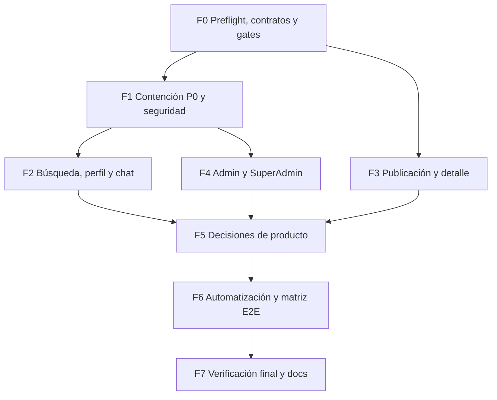

# Superplan orquestado — Remediación integral de incidencias E2E

> [!important] Estado
> Este archivo es un **plan de ejecución**, no una constancia de remediación. Ninguna incidencia se considera resuelta hasta completar su prueba dirigida, regresión por rol/país y gates finales. No autoriza `push`, despliegue, cambios en producción ni limpieza destructiva.

## 1. Objetivo

Resolver de forma coordinada las incidencias registradas en:

- [[e2e-publico-incidencias]]
- [[e2e-client-incidencias]]
- [[e2e-professional-incidencias]]
- [[e2e-publicacion-multipais-incidencias]]
- [[e2e-admin-incidencias]]
- [[e2e-superadmin-incidencias]]

El cierre exige:

1. Corregir P0/P1 con pruebas de contrato, seguridad y regresión.
2. Alinear frontend/backend por contrato y proteger rol/país.
3. Actualizar los casos E2E cuando el hallazgo sea documental o de producto.
4. Verificar `cl`, `ar`, `uy`, `es`, `us` sin duplicar pruebas sobre código idéntico.
5. Probar proveedores externos solo en sandbox; ausencia de credenciales = `BLOCKED`.
6. Conservar evidencia antes de cambiar un `FAIL` a `RESOLVED`.

> [!warning] Worktree compartido
> Ya existen cambios ajenos y archivos sin seguimiento. Está prohibido limpiar, resetear, reescribir o incorporar cambios no atribuibles a este plan. Cada tarea comprueba el diff antes de editar.

## 2. Inventario normalizado

Los informes reutilizan `INC-012`, `INC-013` e `INC-014` para defectos distintos. Este plan usa prefijos de origen.

| ID | Severidad | Hallazgo | Track |
|---|---:|---|---|
| `PUB-001A` | Alta | Ubicación manual termina como búsqueda `q`, no geo | Búsqueda |
| `PUB-001B` | Alta | `CATEGORY_MAP` contiene slugs inexistentes en el catálogo | Catálogo |
| `PUB-002` | Crítica | Forgot-password cambia hash antes de confirmar email | Auth |
| `CLI-003` | Media/seguridad | Client accede a páginas/endpoints Professional | RBAC |
| `CLI-004/004B` | Alta/Baja | Password persiste con error, sesión rota y política inconsistente | Auth |
| `CLI-005` | Crítica | Direcciones llaman endpoint exclusivo de SuperAdmin | Perfil/geo |
| `CLI-006` | Crítica | Widget chat usa token inexistente y muestra mensajes fantasma | Chat |
| `CLI-007/008` | Media/Baja | Eco de mensajes y fechas `Invalid Date`/`NaN` | Chat/fechas |
| `PRO-009` | Alta | IA espera `{data}` pero categorías devuelve array plano | Publicación |
| `PRO-010` | Alta | Create/update discrepan sobre teléfono; Zod crudo | Publicación |
| `PRO-011` | Media | Ficha stale hasta 60 s tras editar/desactivar | Caché |
| `PRO-012` | Crítica | Interceptor global convierte `Date` en `{}` | Serialización |
| `PRO-013` | Alta | Contador de reseñas hardcodeado en cero | Métricas |
| `PRO-014` | Alta | Mismo cluster de password/sesión que Client | Auth |
| `MP-012` | Alta | Redes sociales persisten pero no se muestran | Detalle |
| `MP-013` | Alta | Upload por IP, 429 opaco y archivos huérfanos | Upload |
| `MP-014` | Alta | Duplicado funcional de `PRO-009` | Publicación |
| `MP-015` | Media-Alta | Wizard de EE. UU. hardcodeado en español | i18n |
| `ADM-016/017` | Alta/Baja | Admin crea categorías globales y luego no puede gestionarlas | Taxonomía |
| `ADM-018` | Baja | Search/paginación de precios es decorativo; países repite patrón | Admin/config |
| `SUP-019` | Alta/producto | Crear país en DB no lo vuelve operativo | Países |
| `SUP-020` | Media/datos | Promover a SuperAdmin conserva `countryId` | Roles |
| `SUP-021` | Media | Precios muestran conteos stale hasta reload | Caché admin |
| `SUP-022` | Alta | Resumen nacional muestra KPIs globales para SuperAdmin | Scope |

### Consolidaciones obligatorias

- `PRO-009` y `MP-014` son un solo defecto en `generarDescripcionIA`.
- `CLI-004`, `CLI-004B` y `PRO-014` son un solo track de password/sesión.
- `PRO-012` y la parte de fechas de `CLI-007/008` comparten causa estructural.
- `ADM-016/017` y el fallo de categorías SuperAdmin comparten contrato de taxonomía.
- `ADM-018` y el buscador de países comparten parámetros decorativos.

### Decisiones, no bugs

| ID | Hallazgo | Tratamiento |
|---|---|---|
| `DEC-REQ-001` | El wizard `ServiceRequest` no existe; ambos CTA abren chat | Gate de producto |
| `DOC-SLUG-001` | Slug ajeno da 404; redirect solo defensivo | Corregir caso E2E |
| `CFG-PAY-001` | Pagos/Premium deshabilitados en los cinco países | `NOT-APPLICABLE` |
| `CFG-KYC-001` | Stripe KYC sin credenciales | `BLOCKED`, no simular |

## 3. Reglas de ejecución

1. Mismo worktree y terminales frescos; no crear worktree por fase salvo conflicto real demostrado.
2. Contrato primero: interface/DTO y test de contrato antes de backend/frontend.
3. Worker de `frontend/` carga `nextjs-ddd-expert`; worker de `backend/` carga `nestjs-architect`. Skill ausente = tarea `BLOCKED`.
4. No tocar configuración (`package.json`, lock, tsconfig, Biome, Next, Nest, Playwright) sin autorización adicional.
5. No agregar paquetes por defecto.
6. Frontend no escribe Nest/Prisma; backend no escribe JSX/Tailwind.
7. Un lease de archivo por ola; dos workers nunca editan el mismo archivo a la vez.
8. `worker_done` no basta: coordinador lee diff y ejecuta la prueba dirigida.
9. Solo fixtures locales; no tocar SuperAdmin reales ni países reales destructivamente.
10. No hacer commit, push ni deploy automáticamente.

## 4. Protocolo Orca

1. Crear Run por ejecución aprobada y tareas con `deps` explícitas.
2. Crear todas las tareas independientes antes de iniciar workers.
3. Despachar toda la ola `ready` antes de esperar.
4. Usar `worker-start --worktree current`; máximo tres workers editores más coordinador.
5. Supervisar con `check --wait --types worker_done,escalation,question`.
6. Preguntas worker→coordinador usan `ask/reply`; decisiones del DAG usan gates.
7. Tras cada `worker_done`, reutilizar de inmediato o ejecutar `worker-release`.
8. Antes de cerrar: `task-list`, `dispatch-show`, `terminal list` y barrido de terminales.
9. Los briefs apuntan a esta nota/sección; no enviar textos largos por `terminal send`.

Lecturas y preparación de tests son asíncronas. Migraciones, contratos compartidos, fixtures mutantes, gates y build final son sincrónicos.

## 5. Gates y defaults autónomos

Las ramas no relacionadas avanzan mientras un gate espera. Al llegar a la rama bloqueada se aplica el default conservador, salvo que el usuario resuelva distinto.

| Gate | Pregunta | Default recomendado |
|---|---|---|
| `G-TAXONOMY` | ¿Quién crea categorías globales/país? | Conservar catálogo actual global. Solo SuperAdmin crea global/padre; Admin no crea global y ve controles deshabilitados con explicación. |
| `G-REQUEST` | ¿Wizard o chat-only? | Wizard mínimo con contrato actual (`categoryId`, `countryId`, `description`, `urgency`); Chat queda separado. Sin presupuesto/ubicación. |
| `G-COUNTRY` | ¿Crear país debe lanzar un mercado? | Tratarlo como provisioning. No operativo hasta routing, geo, categorías, i18n y gateway listos. |
| `G-PASSWORD` | Política única | 8+ con mayúscula, minúscula, número y especial; mensajes por campo; solo passwords nuevos. |
| `G-UPLOAD` | Límite legítimo/abuso | Tracker usuario, fallback IP pre-sesión, mínimo 60 imágenes/h, `Retry-After`, reusar uploads exitosos y cleanup. |
| `G-SESSION` | Refresh o logout tras password | Logout limpio con aviso y retorno a login. |
| `G-PREMIUM-UI` | Precios con pagos off | Vista read-only con badge; bloquear writes. |

Ningún default activa pagos, toca producción, borra datos ni usa cuentas reales.

## 6. Modelos, skills y eficiencia

| Trabajo | Modelo | Esfuerzo | Skill | Razón |
|---|---|---:|---|---|
| Coordinación/DAG | Sonnet 5 o `gpt-5.6-terra` | Medium | `orchestration` | Trabajo cotidiano |
| Reset seguro, roles y revisión P0 | `gpt-5.6-sol` | High | `nestjs-architect` | Alto riesgo auth/scope |
| Backend rutinario | `gpt-5.6-terra` | Medium/High | `nestjs-architect` | Complejidad media |
| Next.js/React/i18n/chat | `gpt-5.6-terra` | Medium | `nextjs-ddd-expert` | Implementación cotidiana |
| E2E repetitivo/inventario | `gpt-5.6-luna` o Haiku 4.5 | Medium | Skill de capa si edita | Menor coste |
| Revisión cross-stack final | `gpt-5.6-sol` | High | Ambas por revisión | Gate de mayor impacto |

No usar Fable, Opus 5 ni Extra High/Max/Ultra. Si un launcher falla, Orca registra el intento y usa el siguiente modelo válido; jamás atribuye trabajo a un worker que no arrancó.

## 7. DAG maestro



## 8. Fases

### Fase 0 — Preflight, evidencia y contratos

**Modo:** baseline sincrónico; análisis posterior en paralelo.

| Tarea | Trabajo | Dependencias |
|---|---|---|
| `F0-T01` | Capturar status raíz/submódulos, procesos dev, puertos y diffs citados | — |
| `F0-T02` | Revalidar cada FAIL: `confirmed/stale/duplicate/decision/external-blocked` | `F0-T01` |
| `F0-T03` | Ledger incidencia→archivo→test y leases | `F0-T02` |
| `F0-T04` | Congelar contratos reset, país público/admin, categoría, fecha ISO, 429 y ServiceRequest | `F0-T02` |
| `F0-T05` | Crear los siete gates | `F0-T03` |
| `F0-T06` | Preparar fixtures reversibles y queries; no limpiar | `F0-T03` |

**Salida:** ningún editor arranca sin caso reproducible, lease y criterio de rollback.

### Fase 1 — Contención P0, integridad y seguridad

**Modo:** dos olas; tareas de archivos disjuntos asíncronas.

#### Ola backend

| Tarea | IDs | Entrega | Dependencias |
|---|---|---|---|
| `F1-T01` | `PUB-002` | Token reset de un uso, hasheado, expiración y consumo atómico. Fallo Brevo no cambia password/tokenVersion | `F0-T04`, `G-PASSWORD` |
| `F1-T02` | `PRO-012`, fechas | Interceptor preserva/convierte `Date` a ISO; tests de arrays, Decimal, null y campos sensibles | `F0-T04` |
| `F1-T03` | `CLI-003` | RolesGuard Professional en leads/quotes; Client 403, Professional 200 | `F0-T04` |
| `F1-T04` | `ADM-016` | Impedir create global por Admin y aplicar requester/scope | `G-TAXONOMY` |
| `F1-T05` | `SUP-020` | SuperAdmin→country null; Admin→país obligatorio; promoción/degradación atómicas | `F0-T04` |

`F1-T01` usa Sol High. No ejecutar `F1-T04` y `F1-T05` en paralelo si comparten controller/service.

#### Ola frontend crítica

| Tarea | IDs | Entrega | Dependencias |
|---|---|---|---|
| `F1-T06` | `CLI-005` | Perfil usa `/geo/countries` tipado con `id`; modal admin conserva loader de inactivos | `F0-T04` |
| `F1-T07` | `CLI-006` | `backendToken`, sin `any`, sin optimistic fantasma y con error accionable | `F0-T04` |
| `F1-T08` | `CLI-003` | Pages Professional verifican rol antes de cargar datos | `F1-T03` |
| `F1-T09` | `PUB-002` | UI request/confirm reset y mensaje anti-enumeración | `F1-T01` |

**Gate:** hash intacto si email falla; Date nunca `{}`; Client denegado; dirección crea; chat persiste.

### Fase 2 — Búsqueda, sesión, chat y fechas

**Modo:** tres tracks asíncronos; chat espera serialización backend.

| Tarea | IDs | Trabajo | Dependencias |
|---|---|---|---|
| `F2-T01` | `PUB-001A` | Separar problema/ubicación; resolver geo o exigir selección; nunca `q=ubicación` | `F0-T04` |
| `F2-T02` | `PUB-001B` | Candidatos desde categorías reales por país; eliminar slugs paralelos y corregir specs | `F0-T04` |
| `F2-T03` | `CLI-004/4B`, `PRO-014` | Schema/copy único, errores tipados y logout limpio tras éxito | `F1-T01`, gates password/session |
| `F2-T04` | `CLI-007` | Ack/join antes de enviar; optimistic con ID temporal y reconciliación | `F1-T02`, `F1-T07` |
| `F2-T05` | `CLI-007/008` | Helper seguro de fechas por locale; auditar chat/leads/quotes | `F1-T02` |
| `F2-T06` | Chat security | Deep link ajeno y dos sesiones reales | `F2-T04`, `F2-T05` |

Leases: un owner para `HeroSearchBar/matchmaking`; `users/actions/mutations.ts` exclusivo de `F2-T03`; `ChatMensajes` y `ChatWindow` no se editan simultáneamente.

### Fase 3 — Publicación, detalle, upload e i18n

**Modo:** tres tracks paralelos; todo lo que toca `Paso2TuOficio.tsx` es secuencial.

| Tarea | IDs | Trabajo | Dependencias |
|---|---|---|---|
| `F3-T01` | `PRO-009/MP-014` | Consumir array plano; una implementación, dos regresiones | `F0-T04` |
| `F3-T02` | `PRO-010` | Alinear teléfono create/update; Zod legible antes de Server Action | `F0-T04` |
| `F3-T03` | `PRO-011` | Invalidar tag `country+slug` en update/toggle/delete y listados | `F3-T02` |
| `F3-T04` | `MP-012` | Componente detail de redes, URLs seguras y a11y | `F0-T04` |
| `F3-T05` | `PRO-013` | Derivar reseñas desde contrato real; eliminar placeholder | `F0-T04` |
| `F3-T06` | `MP-013` | Tracker/límite, Retry-After, uploads reusables, mensaje 429 y cleanup | `G-UPLOAD` |
| `F3-T07` | `MP-015` | Diccionario ES/EN completo y paridad de claves | `F3-T06` |

**Gate:** IA funciona invitado/Pro; regla teléfono coherente; ficha actualiza inmediata; ocho redes visibles; US íntegramente inglés; NAT no bloquea publicaciones legítimas.

### Fase 4 — Admin y SuperAdmin

**Modo:** dashboard/roles paralelos; países soportados tiene un único owner.

| Tarea | IDs | Trabajo | Dependencias |
|---|---|---|---|
| `F4-T01` | `ADM-016/017` | UI taxonomía según gate; acciones imposibles deshabilitadas con razón | `F1-T04` |
| `F4-T02` | `SUP-022` | Pasar país URL a users/services/metrics del Resumen | `F0-T04` |
| `F4-T03` | `SUP-020` | UI refleja país null y exige país al degradar | `F1-T05` |
| `F4-T04` | `SUP-021` | Refrescar todos los grupos tras create/delete, sin reload | `F0-T04` |
| `F4-T05` | `ADM-018` | Search/paginación real en precios y mismo patrón en países | `F4-T04` |
| `F4-T06` | Premium UI | Read-only/badge y writes bloqueados con pagos off | `F4-T05` |
| `F4-T07` | `SUP-019` | Provisioning/readiness o limitar honestamente el CRUD; error real al crear Admin | `G-COUNTRY` |

**Gate de seguridad:** Admin CL nunca altera catálogo AR; SuperAdmin en `/ar/admin` ve KPIs AR, no globales.

### Fase 5 — Decisiones de producto y alcance

**Modo:** sincrónico al aplicar resoluciones; no bloquea fixes independientes.

| Tarea | Default | Cierre |
|---|---|---|
| `F5-T01` `DEC-REQ-001` | Wizard mínimo con DTO actual | Client crea request sin SQL, Pro cotiza, Client acepta |
| `F5-T02` `DOC-SLUG-001` | Expected 404 | Caso E2E corregido, redirect queda defensivo |
| `F5-T03` País nuevo | Provisioning | No “activo” si falta readiness |
| `F5-T04` Pagos/KYC | Mantener N/A/BLOCKED | No simular proveedor |

### Fase 6 — Automatización y matriz E2E

**Modo:** suites asíncronas; fixtures mutantes serializados.

| Tarea | Cobertura |
|---|---|
| `F6-T01` | Backend: reset token, Date, guards, categoría, roles, upload 429 |
| `F6-T02` | Público/Client: search, reset, direcciones, chat, password, request, deep-link ajeno |
| `F6-T03` | Pro/Publicación: IA, teléfono, caché, redes, upload, i18n, métricas |
| `F6-T04` | Admin/SuperAdmin: taxonomía, scope, KPIs URL, roles, precios, provisioning |
| `F6-T05` | Países: `cl` completo, `es/us` segunda familia y aislamiento cinco Admin |
| `F6-T06` | Sandbox: MP, Stripe, Brevo, Cloudinary, Gemini, KYC solo si configurados |

Reglas: parametrizar por país; fixtures `E2E-<ROL>-<PAIS>-<timestamp>`; conservar trace/screenshot/video; limpiar solo IDs de la corrida con procedimiento autorizado.

### Fase 7 — Verificación final y cierre

**Modo:** completamente sincrónico.

1. Congelar ediciones y esperar todos los `worker_done`.
2. Leer diffs y excluir configuración/cambios ajenos.
3. Ejecutar tests dirigidos por paquete.
4. Arrancar backend compilado y hacer smoke HTTP; build no basta para NestJS DI.
5. Detectar `pnpm dev`; detener solo procesos del worktree antes del build.
6. Ejecutar desde raíz:

   ```bash
   pnpm lint && pnpm build
   ```

7. Reiniciar dev solo si estaba activo y comprobar puertos.
8. Ejecutar matriz crítica y clasificar `PASS/FAIL/BLOCKED/NOT-APPLICABLE`.
9. Actualizar los seis informes conservando historial/evidencia.
10. Actualizar índices `.doc`, enlaces y nota SitesDoc.
11. Barrer tasks/dispatches/terminales y liberar workers.
12. Entregar archivos, comandos, tests, bloqueos y defaults aplicados. Sin commit/push/deploy.

## 9. Leases y olas

| Lease | Dominio | Orden obligatorio |
|---|---|---|
| `L-AUTH-BE` | auth/reset/model/tests | `F1-T01` → `F1-T09/F2-T03` |
| `L-USERS-FE` | users mutations/settings | Solo `F2-T03` |
| `L-CHAT-FE` | ChatMensajes/ChatWindow/socket | `F1-T07` → `F2-T04` |
| `L-DATE` | interceptor/chat/date helpers | `F1-T02` → `F2-T05` |
| `L-PUBLISH-ACTION` | publish actions | Un owner para `PRO-009/MP-014` |
| `L-PASO2` | Paso2TuOficio/dicts | `F3-T06` → `F3-T07` |
| `L-SERVICE-MUT` | service schemas/actions | `F3-T02` → `F3-T03` |
| `L-CATEGORIES` | controller/service/form/table | `F1-T04` → `F4-T01` |
| `L-PRICES` | precios/revalidation | `F4-T04` → `F4-T05` → `F4-T06` |
| `L-COUNTRIES` | proxy/layout/auth/webhooks/config | `F4-T07` → `F5-T03`, un owner |

Olas recomendadas:

- A: `F1-T01`, `F1-T02`, `F1-T03`.
- B: `F1-T04`, `F1-T05`, `F1-T06`.
- C: `F1-T07`, `F2-T01`, `F3-T01`.
- D: `F2-T03`, `F2-T04`, `F3-T04`.
- E: `F3-T02/F3-T03`, `F3-T05`, `F4-T02`.
- F: `F3-T06/F3-T07`, `F4-T01`, `F4-T03`.
- G: `F4-T04/F4-T05/F4-T06` y `F4-T07/F5-T03`.

## 10. Criterios de aceptación

- [ ] Fallo de email no cambia password, emailVerified ni tokenVersion.
- [ ] Token reset expira, se usa una vez y no enumera cuentas.
- [ ] Client recibe 403/unauthorized en Professional; Professional accede.
- [ ] Direcciones crean/editan sin endpoint admin.
- [ ] Widget/página chat persisten, ordenan y no duplican mensajes.
- [ ] Ninguna fecha viaja como `{}` ni muestra NaN/Invalid Date.
- [ ] Home conserva problema y geo; categorías usan slugs reales.
- [ ] Cambio de password informa requisitos y termina en sesión limpia.
- [ ] IA funciona para invitado y Professional con un solo fix.
- [ ] Create/update servicio comparten regla de teléfono y errores legibles.
- [ ] Mutaciones invalidan ficha/listados inmediatamente.
- [ ] Redes persistidas aparecen con enlaces seguros.
- [ ] Cinco imágenes legítimas no quedan bloqueadas por NAT; 429 informa espera.
- [ ] Wizard US está en inglés y países hispanos en español.
- [ ] Admin no crea/muta taxonomía fuera de autorización.
- [ ] SuperAdmin limpia país; Admin exige país.
- [ ] Dashboard nacional SuperAdmin usa país URL.
- [ ] Precios/países buscan y paginan; UI refresca sin reload.
- [ ] País nuevo no opera antes del readiness.
- [ ] ServiceRequest nace desde UI o el caso E2E refleja explícitamente otra decisión.
- [ ] `pnpm lint && pnpm build` verde con dev detenido de forma segura.
- [ ] Backend compilado arranca; tests dirigidos/E2E críticos pasan.
- [ ] Sin secretos, producción, cambios ajenos, commits o push no autorizados.

## 11. Proveniencia de planificación

Plan sintetizado con Orca Orchestration, Run `run_27bcefa6eb45`:

- Público + Client: `task_1d9367d5852f` — completada.
- Professional + Publicación: `task_879e3e334c71` — completada.
- Admin + SuperAdmin: `task_a0bb89f69755` — completada.

El coordinador leyó los seis documentos completos y contrastó los informes. Los intentos iniciales con Codex fallaron por un prompt de actualización y no se les atribuyó trabajo. Los tres análisis válidos se ejecutaron con Grok, enviaron `worker_done` y sus terminales fueron liberados.

> [!question] Aprobación
> ¿Apruebas este plan? ¿Qué cambiarías?
